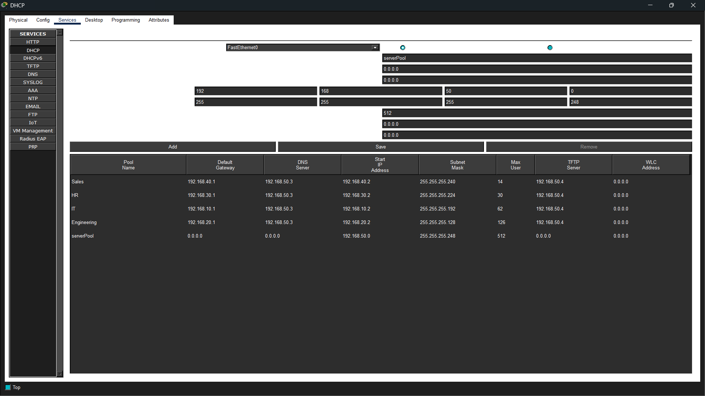

# Improved Enterprise Network

## Objectives
This project's main objectives are to improve the design, security and redundancy of the already existing design from this same repository.

### Notes
This section contains notes regarding each step of the project. For now, subnets, server IPs and the DHCP server were configured

SERVERS

255.255.255.248 ( sau 192.168.50.0/29 )

- DHCP - 192.168.50.2
- DNS - 192.168.50.2
- TFTP & FTP - 192.168.50.3
- WEB - 192.168.50.4
- MAIL - 192.168.50.5
- SNMP - 192.168.50.6

Subnets:
- IT:
192.168.10.1 - gateway
192.168.10.2 - .62 gazde (64 block size, 255.255.255.192 subnet mask)

- Engineering:
192.168.20.1 - gateway
192.168.20.2 - .126 gazde (128 block size, 255.255.255.128 subnet mask)

- HR:
192.168.30.1 - gateway
192.168.30.2 - .30 gazde (32 block size, 255.255.255.224 subnet mask)

- Sales:
192.168.40.1 - gateway
192.168.40.2 - .14 gazde (16 block size, 255.255.255.240 subnet mask)

*DHCP Server*

### Note for 25.06.2026:
- Created VLANs for each subnet including the servers
- Added description to alredy connected interfaces
- Configured a user and encrypted password for when logging into the device (router for now) via locally or via SSH. Therefore also implemented SSH for remote access.
- Implemented DAI (Dynamic ARP Inspection) and DHCP Snooping for the switch's interfaces connected to servers, just in case, for better security.
